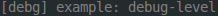
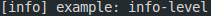
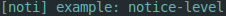
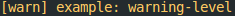
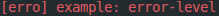
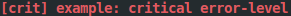

# libsir

 

## Synopsis

libsir is a cross-platform, thread-safe C (C11) logging library that is designed to simplify and streamline the generation of human-readable information in software.

Using libsir, you can make a single call that simultaneously sends information to multiple destinations, _each with their own individual preference for format and levels_.

Each 'level' or 'priority' of output can be visually styled however you wish for `stdio` destinations. This allows for immediate visual confirmation that a message appeared in the terminal that you should pay attention to, while less pressing information is more subtle in appearance.

## Notables

- _No dependencies_ (other than `libc` and `pthreads`). On Windows, libsir uses the native sychronization API.
- Accompanied by a robust _test suite_ to ensure dependable behavior, even if you make modifications to the source.
- Won't fail silently&mdash;C library or platform level errors are captured and stored for posterity, on a per-thread basis. The _function, file, and line number from which it orginated_ are also captured. Additionally, libsir defines its own set of error messages to aid in troubleshooting.
- Hardened&mdash;every function contains sanity checks for internal state as well as arguments passed in through the external interfaces. libsir's make recipes use &ndash;_Wpedantic_, too.
- [Full documentation](https://aremmell.github.io/libsir), thanks to Doxygen.

## Cross-platform compatibility

Currently, libsir uses a hand-rolled Unix Makefile. Despite that, I (_and Travis CI_) have successfully compiled and verified the test suite in these environments:

| Toolset | OS               | Architecture|
| -------- | ---------------- | :------------|
| gcc 5.4.0 | Ubuntu 16.04     | amd64 |
| gcc 7.3.0 | Ubuntu 18.04     | armhf|
| clang 7.0.0 | Ubuntu 18.04 | amd64 |
| clang 6.0.0 | Ubuntu 18.04 | arm64 |
| gcc 7.5.0 | Ubuntu 18.04 | arm64 |
| gcc 7.3.0 (MinGW) | Windows 10       | x86_64 |
| clang 9.1.0 | macOS 10.13.4    | x86_64 |
| clang 14.0.0 | macOS 12.6 | x86_64 |
| clang 14.0.3 | macOS 13.3.1 | x86_64 |
| clang 14.0.3 | macOS 13.3.1 | arm64 |
| clang 14.0.5 | FreeBSD 13.2 | amd64 |

There is a VS Code workspace file included, in case you'd like to use that. In the future, I will likely use CMake or autotools to generate the compilation scripts.

## Implementation details

### Output destinations

- `stdout` / `stderr`
- `syslog`
- _n_ number of log files (_archived automatically a'la logrotate when they get too big_)

### Informational output

libsir is able to output certain data that may contribute to better comprehension of the program state (_particularly for debugging postmortem_). Each destination may be configured to receive any, all, or none of these.

> Note: the format of this data may be customized for your application. See [Customization](#customization) for more information.

| Data             |  Description                          | stdio   | syslog[^1] | files   |
| ---------------- | ------------------------------------- | :-----: | :------:   | :-----: |
| Timestamp        | The current time (_hour, min, sec_)   | ✓       |            | ✓       |
| Milliseconds     | 1/1000^ths^ of the current second     | ✓       |            | ✓       |
| Level            | Human-readable level _(e.g. 'warn')_  | ✓       |            | ✓       |
| Name             | Name of the process                   | ✓       | ✓          | ✓       |
| Process ID       | The current process identifier        | ✓       | ✓          | ✓       |
| Thread ID        | The current thread identifier         | ✓       |            | ✓       |

[^1]: `syslog` already include these categories of data on its own, so libsir purposely omits them._

### Logging levels

In addition to decoration options, each destination may be registered to receive any, none, or all priority levels of output. The available levels may be overly granular, but it's better to have unused levels rather than need another one and not have it.

| Level       | Description                                  |
| ----------- |  ------------------------------------------: |
| Debug       | Debugging/diagnostic output.                 |
| Information | Informational messages.                      |
| Notice      | Normal but significant.                      |
| Warning     | Warnings that could likely be ignored.       |
| Error       | Errors.                                      |
| Critical    | Critical errors.                             |
| Alert       | Action required ASAP.                        |
| Emergency   | Nuclear war, Armageddon, the sky is falling. |

## Customization

### Formatting and Limits

The following can be modified to alter behavior, and are located in [sirconfig.h](./sirconfig.h). This is not an exhaustive list, and you should read the header for more information:

| Entry              | Description                       | Default                                                                                 |
| -----              | -----------                       | :------:
| `SIR_TIMEFORMAT`   | The time stamp format string at the beginning of log messages.                                | `"%H:%M:%S"`                               |
| `SIR_MSECFORMAT`   | The format for the current millisecond in time stamps.                                         | `".%03ld"`                               |
| `SIR_LEVELFORMAT`  | The format for the human-readable logging level.                                             | `"[%s]"`                               |
| `SIR_PIDFORMAT`    | The format for the current process/thread ID.                                                | `"%d"`                               |
| `SIR_FOPENMODE`    | The string passed to fopen/fopen_s for log files.                                            | `"a"`                               |
| `SIR_FROLLSIZE`    | The size, in bytes, at which a log file will be rolled/archived.                            | `(1024L * 1024L * 5L)`                               |
| `SIR_FHTIMEFORMAT` | The time format string in file headers.                                                     | `"%H:%M:%S %a %d %b %y (%z)"`                               |
| `SIR_FHFORMAT`     | The format string written to a log file when logging begins or the file is rolled/archived. | `"\n\n----- %s %s -----\n\n"`                               |
| `SIR_FHBEGIN`      | The string included in `SIR_FHFORMAT` when a file is rolled/archived due to size. | `"session begin @"`                               |
| `SIR_FHROLLED`     | The string included in `SIR_FHFORMAT` when a file is rolled/archived due to size. | `"archived as %s due to size @"`    |
| `SIR_FNAMEFORMAT`  | The format string for rolled/archived log file names.                             | `"%s-%s%s"`                               |
| `SIRL_S_EMERG`     | The human-readable form of the `SIRL_EMERG` level.                                 | `"emrg"`                               |
| `SIRL_S_ALERT`     | The human-readable form of the `SIRL_ALERT` level.                               | `"alrt"`                               |
| `SIRL_S_CRIT`      | The human-readable form of the `SIRL_CRIT` level.                                | `"crit"`                               |
| `SIRL_S_ERROR`     | The human-readable form of the `SIRL_ERROR` level.                               | `"erro"`                               |
| `SIRL_S_WARN`      | The human-readable form of the `SIRL_WARN` level.                                | `"warn"`                               |
| `SIRL_S_NOTICE`    | The human-readable form of the `SIRL_NOTICE` level.                              | `"noti"`                               |
| `SIRL_S_INFO`      | The human-readable form of the `SIRL_INFO` level.                                | `"info"`                               |
| `SIRL_S_DEBUG`     | The human-readable form of the `SIRL_DEBUG` level.                               | `"debg"`                               |
| `SIR_MAXFILES`     | The maximum number of log files that may be registered.                          | `16`                               |
| `SIR_MAXMESSAGE`   | The maximum number of characters that may be included in a message, not including other parts of the output, like the timestamp and level. | `2048`|

### Default options, levels, and text styles

#### Options

The following are the defaults used when `SIRL_DEFAULT` or `SIRO_DEFAULT` are used. These are located in [sirdefaults.h](./sirdefaults.h):

Destination      |  Levels     | Options
-----------      | :-------:   | -------
stdout         | `SIRL_DEBUG \| SIRL_INFO \| SIRL_NOTICE \| SIRL_WARN` | `SIRO_NOTIME \| SIRO_NOPID \| SIRO_NOTID`
stderr         | `SIRL_ERROR \| SIRL_CRIT \| SIRL_EMERG` | `SIRO_NOTIME \| SIRO_NOPID \| SIRO_NOTID`
syslog         | `SIRL_WARN  \| SIRL_CRIT \| SIRL_ALERT \| SIRL_EMERG` | `N/A (syslog has its own styling)`
log files      | `SIRL_ALL`  | `0 (all output)`

#### Styles

libsir "styling" is another way of saying ANSI escape color coding. Currently, libsir supports [4-bit (16-colors)](https://en.wikipedia.org/wiki/ANSI_escape_code#3-bit_and_4-bit). Future releases will support 8-bit and 24-bit colors.

Supported terminals will render text from libsir based on the "styles" used in libsir. The following define the default text styling to use for `stdout` / `stderr` on a per-level basis (_can be changed at runtime with_ `sir_settextstyle` located in [sirdefaults.h](./sirdefaults.h)):

 Level         |                      Style                        | Sample
 ------------- | :-----------------------------------------------: | ------------------------------------------------------------
 `SIRL_DEBUG`  |                 `SIRS_FG_DGRAY`                   | 
 `SIRL_INFO`   |                 `SIRS_FG_WHITE`                   | 
 `SIRL_NOTICE` |                 `SIRS_FG_CYAN`                    | 
 `SIRL_WARN`   |                `SIRS_FG_YELLOW`                   | 
 `SIRL_ERROR`  |                  `SIRS_FG_RED`                    | 
 `SIRL_CRIT`   |           `SIRS_BRIGHT \| SIRS_FG_RED`            | 
 `SIRL_ALERT`  | `SIRS_BRIGHT \| SIRS_FG_BLACK \| SIRS_BG_LYELLOW` | 
 `SIRL_EMERG`  |  `SIRS_BRIGHT \| SIRS_FG_LYELLOW \| SIRS_BG_RED`  | 

## Installation

Clone or download this repository to your machine, then choose how you'd like to integrate libsir into your project:

### Make

#### Tinkering/testing

Recipe Type        | Command        | Output file
------        | -------        | -----------
Test suite    | `make tests`   | _build/sirtests[.exe]_
Example app   | `make example` | _build/sirexample[.exe]_

#### Production

Recipe Type         | Command             | Output file
------         | -------             | -----------
Static library | `make static`       | _build/lib/libsir_s.a_
Shared library | `make shared`       | _build/lib/libsir.so_
Install[^2]    | `sudo make install` | /usr/local/lib/libsir.so, /usr/local/include/&lt;headers&gt;

[^2]: Use `sudo make install` only if you have looked at the recipe and understand that it manually copies files, that’s it. Future releases of libsir will utilize the `install` tool when available.

> If you'd like to debug libsir, just swap out the commented debug flags in [the makefile](./Makefile).

Another option for implementing libsir would simply be to include all of the source files in the root directory of this repository and include [sir.h](./sir.h).

### Preprocessor

- For my own development purposes, I included a preprocesor define that causes libsir to log certain events to `stderr` that may be useful in diagnosing problems if/when they arise: `-DSIR_SELFLOG`.
- You should also be aware that `assert` is used in libsir. If you build _without_ `-DNDEBUG`, and an `assert` triggers, your program will halt (`assert` calls `abort` if the expression is `false`).

### Why libsir?

libsir was originally written in 2003 for my own personal use, and I rediscovered it recently. I looked at it, and realized that it was woefully inadequate and decided to compeltely rewrite it. I also decided to make it publically available, because I think it's a pretty good library, and I hope that it will be useful to others.

### Further reading

If you are genuinely interested in utilizing libsir, I strongly encourage you to read the [full online documentation](https://aremmell.github.io/libsir) to get a better understanding of the library's capabilities and interfaces.
