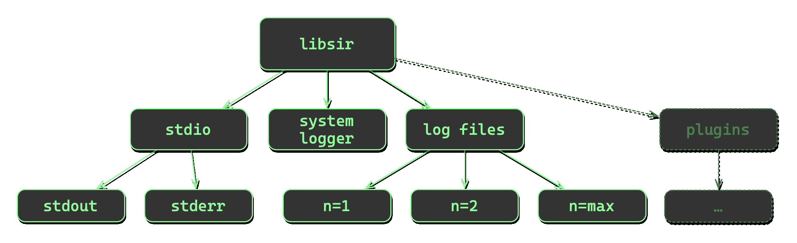
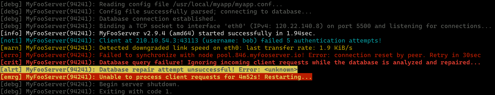

# libsir

 

## Synopsis

libsir is a cross-platform, thread-safe logging library written in C that is designed to simplify and streamline the generation and distribution of human-readable information in software.

Using libsir, you can make a single call that simultaneously sends information to multiple destinations, _each with their own individual preference for format and levels_.

Each 'level' or 'priority' of output can be visually styled however you wish for `stdio` destinations. This allows for immediate visual confirmation that a message appeared in the terminal that you should pay attention to, while less pressing information is more subtle in appearance.

## Notables

- No dependencies (other than `libc` and `pthreads`). On Windows, libsir uses the native sychronization API.
- Accompanied by a robust test suite to ensure dependable behavior, even if you make modifications to the source.
- Won't fail silently&mdash; C library or platform level errors are captured and stored for posterity, on a per-thread basis. The _function, file, and line number from which it orginated_ are also captured. Additionally, libsir defines its own set of error messages to aid in troubleshooting.
- Hardened&mdash; every function contains sanity checks for internal state as well as arguments passed in through the external interfaces. libsir's make recipes use __&ndash;Wall &ndash;-Wextra &ndash;_Wpedantic_, too.
- [Full documentation](https://libsir.rml.dev), thanks to Doxygen.

## Cross-platform compatibility

At this time, the test suite has been compiled and tested on (at minimum) these configurations:

| Toolset   | Versions            | Operating system                     | Architecture |
| :-------- | :-----------------: | :----------------------------------: | -----------: |
| gcc       | 5.4-7.5             |    Ubuntu, Mint, Fedora, FreeBSD     |   x64, armhf, arm64, ppc64le |
| clang     | 6.0-14.0            | macOS, Ubuntu, Mint, FreeBSD, Fedora |   x64, arm64 |
| MSVC (cl) | 17.6                |               Windows                |   x64, arm64 |

## Implementation details

### Output destinations

- `stdout` / `stderr`
- A system logger facility (currently `syslog`, or on macOS, `os_log`).
- _n_ number of log files.

### Informational output

libsir is able to output certain data that may contribute to better comprehension of the program state (_particularly for debugging postmortem_). Each destination may be configured to receive any, all, or none of these.

> Note: the format of this data may be customized for your application. See [Customization](#customization) for more information.

|     Data     |             Description              | stdio | system logger[^1] | files |
| :----------: | :----------------------------------: | :---: | :---------------: | :---: |
|  Timestamp   | The current time (_hour, min, sec_)  |   ✓   |                   |   ✓   |
| Milliseconds |  1/1000^ths^ of the current second   |   ✓   |                   |   ✓   |
|   Hostname   | The local machine’s network hostname |   ✓   |                   |   ✓   |
|    Level     | Human-readable level _(e.g. 'warn')_ |   ✓   |                   |   ✓   |
|     Name     |         Name of the process          |   ✓   |         ✓         |   ✓   |
|  Process ID  |    The current process identifier    |   ✓   |         ✓         |   ✓   |
|  Thread ID   |    The current thread identifier     |   ✓   |                   |   ✓   |

[^1]: System loggers usually include these categories of data on their own, so libsir purposely omits them, but these options can be set at any time.\_

### Logging levels

In addition to decoration options, each destination may be registered to receive any, none, or all priority levels of output. The available levels may be overly granular, but it's better to have unused levels rather than need another one and not have it.

|    Level    | Description                                  |
| :---------: | :------------------------------------------- |
|    Debug    | Debugging/diagnostic output.                 |
| Information | Informational messages.                      |
|   Notice    | Normal but significant.                      |
|   Warning   | Warnings that could likely be ignored.       |
|    Error    | Errors.                                      |
|  Critical   | Critical errors.                             |
|    Alert    | Action required ASAP.                        |
|  Emergency  | Nuclear war, Armageddon, the sky is falling. |

## Customization

### Formatting and Limits

The following can be modified to alter behavior, and are located in [sirconfig.h](./sirconfig.h). This is not an exhaustive list, and you should read the header for more information:

|       Entry        | Description                                                  |             Default              |
| :----------------: | ------------------------------------------------------------ | :------------------------------: |
|  `SIR_TIMEFORMAT`  | The time stamp format string at the beginning of log messages. |           `"%H:%M:%S"`           |
|  `SIR_MSECFORMAT`  | The format for the current millisecond in time stamps.       |            `".%03ld"`            |
|  `SIR_PIDFORMAT`   | The format for the current process/thread ID.                |              `"%d"`              |
|  `SIR_FOPENMODE`   | The string passed to fopen/fopen_s for log files.            |              `"a"`               |
|  `SIR_FROLLSIZE`   | The size, in bytes, at which a log file will be rolled/archived. |      `(1024L * 1024L * 5L)`      |
| `SIR_FHTIMEFORMAT` | The time format string in file headers.                      |  `"%H:%M:%S %a %d %b %y (%z)"`   |
|   `SIR_FHFORMAT`   | The format string written to a log file when logging begins or the file is rolled/archived. |  `"\n\n----- %s %s -----\n\n"`   |
|   `SIR_FHBEGIN`    | The string included in `SIR_FHFORMAT` when a file is rolled/archived due to size. |       `"session begin @"`        |
|   `SIR_FHROLLED`   | The string included in `SIR_FHFORMAT` when a file is rolled/archived due to size. | `"archived as %s due to size @"` |
| `SIR_FNAMEFORMAT`  | The format string for rolled/archived log file names.        |          `"%s-%s%s%s"`           |
|   `SIRL_S_EMERG`   | The human-readable form of the `SIRL_EMERG` level.           |             `"emrg"`             |
|   `SIRL_S_ALERT`   | The human-readable form of the `SIRL_ALERT` level.           |             `"alrt"`             |
|   `SIRL_S_CRIT`    | The human-readable form of the `SIRL_CRIT` level.            |             `"crit"`             |
|   `SIRL_S_ERROR`   | The human-readable form of the `SIRL_ERROR` level.           |             `"erro"`             |
|   `SIRL_S_WARN`    | The human-readable form of the `SIRL_WARN` level.            |             `"warn"`             |
|  `SIRL_S_NOTICE`   | The human-readable form of the `SIRL_NOTICE` level.          |             `"noti"`             |
|   `SIRL_S_INFO`    | The human-readable form of the `SIRL_INFO` level.            |             `"info"`             |
|   `SIRL_S_DEBUG`   | The human-readable form of the `SIRL_DEBUG` level.           |             `"debg"`             |
|   `SIR_MAXFILES`   | The maximum number of log files that may be registered.      |               `16`               |
|  `SIR_MAXMESSAGE`  | The maximum allowed characters in a message, not including additional information. |              `2048`              |

### Default options, levels, and text styles

#### Options

The following are the defaults used when `SIRL_DEFAULT` or `SIRO_DEFAULT` are used. These are located in [sirdefaults.h](./sirdefaults.h):

| Destination |  Levels                                               | Options|
| :---------: | :---------------------------------------------------: | :----------------------------------------------: |
| stdout      | `SIRL_DEBUG \| SIRL_INFO \| SIRL_NOTICE \| SIRL_WARN` | `SIRO_NOTIME \| SIRO_NOHOST \| SIRO_NOPID \| SIRO_NOTID` |
| stderr      | `SIRL_ERROR \| SIRL_CRIT \| SIRL_ALERT \| SIRL_EMERG` | `SIRO_NOTIME \| SIRO_NOHOST \| SIRO_NOPID \| SIRO_NOTID` |
| system logger | `SIRL_NOTICE \| SIRL_WARN \| SIRL_ERROR \| SIRL_CRIT \| SIRL_ALERT  \| SIRL_EMERG` | `SIRO_MSGONLY` |
| log files   | `SIRL_ALL`                                            | `SIRO_ALL`            |

#### Styles

libsir "styling" is just another way of saying ANSI escape color coding. Currently, libsir supports [4-bit (16-colors)](https://en.wikipedia.org/wiki/ANSI_escape_code#3-bit_and_4-bit). Support for 8-bit and 24-bit colors is underway as I write this.

Supported terminals will render text from libsir based on the "styles" used in libsir. The following define the default text styling to use for `stdout` / `stderr` on a per-level basis (_can be changed at runtime with_ `sir_settextstyle` located in [sirdefaults.h](./sirdefaults.h)):

| Level         |                      Style                        |
| :-----------: | :-----------------------------------------------: |
| `SIRL_DEBUG`  |                 `SIRS_FG_DGRAY`                   |
| `SIRL_INFO`   |                 `SIRS_FG_WHITE`                   |
| `SIRL_NOTICE` |                 `SIRS_FG_CYAN`                    |
| `SIRL_WARN`   |                `SIRS_FG_YELLOW`                   |
| `SIRL_ERROR`  |                  `SIRS_FG_RED`                    |
| `SIRL_CRIT`   |           `SIRS_BRIGHT \| SIRS_FG_RED`            |
| `SIRL_ALERT`  | `SIRS_BRIGHT \| SIRS_FG_BLACK \| SIRS_BG_LYELLOW` |
| `SIRL_EMERG`  | `SIRS_BRIGHT \| SIRS_FG_LYELLOW \| SIRS_BG_RED`   |

 Some sample terminal output from libsir demonstrating these defaults:

## Getting started

Clone or download this repository to your machine, then choose how you'd like to integrate libsir into your project:

### Visual Studio Code

There is already a code-workspace in the repository (and  my primary means of compiling and debugging the library across platforms). As of right now, the build and launch tasks are not fully functional for every platform, but that's easy enough to figure out, right?.

### Visual Studio 2022

A very recent addition is an sln and some vcxproj files in the [msvc](./msvc) directory. They are connfirmed to work correctly on Windows 11 (x64 &amp; arm64) with Visual Studio 17.6.

### Unix Makefile

| Recipe Type    |    Command          |       Output file(s)                                          |
| :------------: | :-----------------: | :-----------------------------------------------------------: |
| Test suite     |  `make tests`       |                  _build/sirtests[.exe]_                       |
| Example app    | `make example`      |                  _build/sirexample[.exe]_                     |
| Static library |    `make static`    |                   _build/lib/libsir_s.a_                      |
| Shared library |    `make shared`    |                    _build/lib/libsir.so_                      |
|  Install[^2]   | `sudo make install` |    _`$(INSTALLLIB)`/libsir.so  &amp; `$(INSTALLINC)`/sir.h_   |

[^2]: This recipe isn't really ready for production use. Use it at your own risk&mdash;currently it manually copies files; that’s it. `$(INSTALLLIB)` and `$(INSTALLINC)` are `/usr/local/lib` and `/usr/local/include`, respectively. It's on my TODO list to utilize the `install` tool _(or just ditch the Makefile and use CMake)_.

### Preprocessor definitions

- If you'd like to build a <u>debug version</u> of libsir, simply: `SIR_DEBUG=1 make all`.
- A preprocesor define `SIR_SELFLOG` exists which causes libsir to log internal events to `stderr`, which may be useful in diagnosing problems if/when they arise. It is automatically defined by [the Makefile](./Makfile) when `SIR_DEBUG=1`.
- Turning on `assert` (it’s disabled by default): `SIR_ASSERT_ENABLED`
- Disabling system logger capabilities: `SIR_NO_SYSTEM_LOGGERS`

### Further reading

If you are genuinely interested in utilizing libsir, you are encouraged to read the [full online documentation](https://libsir.rml.dev) to get a better understanding of the library's capabilities and interfaces. *NOTE: the documentation is half-finished at this time because I just completed a major round of refactoring and optimizations. I expect it will be done very soon.*
