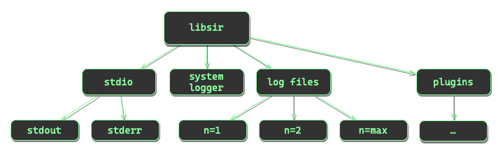
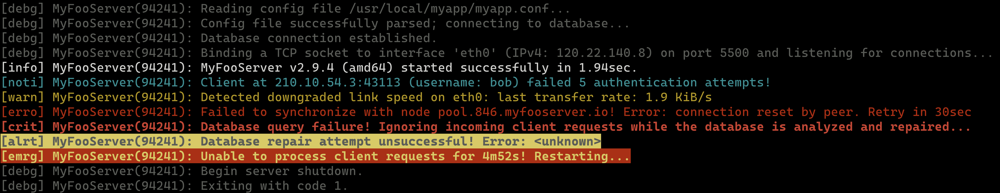

# libsir

libsir&mdash;a lightweight, cross-platform library for information distribution

<!-- Version: 2.2.5 -->
<!-- -->
<!-- SPDX-License-Identifier: MIT -->
<!-- -->
<!-- Copyright (c) 2018-2024 Ryan M. Lederman <lederman@gmail.com> -->
<!-- Copyright (c) 2018-2024 Jeffrey H. Johnson <trnsz@pobox.com> -->
<!-- -->
<!-- Permission is hereby granted, free of charge, to any person obtaining a copy of -->
<!-- this software and associated documentation files (the "Software"), to deal in -->
<!-- the Software without restriction, including without limitation the rights to -->
<!-- use, copy, modify, merge, publish, distribute, sublicense, and/or sell copies of -->
<!-- the Software, and to permit persons to whom the Software is furnished to do so, -->
<!-- subject to the following conditions: -->
<!-- -->
<!-- The above copyright notice and this permission notice shall be included in all -->
<!-- copies or substantial portions of the Software. -->
<!-- -->
<!-- THE SOFTWARE IS PROVIDED "AS IS", WITHOUT WARRANTY OF ANY KIND, EXPRESS OR -->
<!-- IMPLIED, INCLUDING BUT NOT LIMITED TO THE WARRANTIES OF MERCHANTABILITY, FITNESS -->
<!-- FOR A PARTICULAR PURPOSE AND NONINFRINGEMENT. IN NO EVENT SHALL THE AUTHORS OR -->
<!-- COPYRIGHT HOLDERS BE LIABLE FOR ANY CLAIM, DAMAGES OR OTHER LIABILITY, WHETHER -->
<!-- IN AN ACTION OF CONTRACT, TORT OR OTHERWISE, ARISING FROM, OUT OF OR IN -->
<!-- CONNECTION WITH THE SOFTWARE OR THE USE OR OTHER DEALINGS IN THE SOFTWARE. -->

[](https://github.com/aremmell/libsir/releases/latest)
[](https://github.com/aremmell/libsir/commits/master)
[](https://github.com/aremmell/libsir/blob/master/LICENSE)
[](https://www.openhub.net/p/libsir/)
[](https://gitlab.com/libsir/libsir/pipelines/master/latest)
[](https://coveralls.io/github/aremmell/libsir)
[](https://scan.coverity.com/projects/aremmell-libsir)
[](https://api.reuse.software/info/github.com/aremmell/libsir)
[](https://sonarcloud.io/component_measures?id=aremmell_libsir&metric=new_maintainability_rating&view=list)
[](https://sonarcloud.io/component_measures?id=aremmell_libsir&metric=new_reliability_rating&view=list)
[](https://sonarcloud.io/component_measures?id=aremmell_libsir&metric=new_security_rating&view=list)
[](https://securityscorecards.dev/viewer/?uri=github.com/aremmell/libsir)
[](https://www.bestpractices.dev/en/projects/7861)

## <a id="overview" /> Overview

<!-- toc -->

- [Synopsis](#synopsis)
- [Notables](#notables)
- [Cross-platform compatibility](#cross-platform-compatibility)
  - [System Loggers](#system-loggers)
  - [C++ compatibility](#c---compatibility)
  - [Language Bindings](#language-bindings)
- [An example](#an-example)
- [Building from source](#building-from-source)
  - [Unix Makefile](#unix-makefile)
    - [Environment Variables](#unix-makefile-envvars)
    - [Recipes](#unix-makefile-recipes)
  - [Visual Studio Code](#visual-studio-code)
    - [Build Tasks](#vs-code-build-tasks)
  - [Visual Studio 2022](#visual-studio-2022)
    - [MSBuild](#ms-build-tools)
- [Dig in](#dig-in)
  - [GNU Global](#gnu-global)
- [SAST Tools](#sast-tools)
- [Other Tools](#other-tools)

<!-- tocstop -->

## <a id="synopsis" /> Synopsis

libsir is a cross-platform, thread-safe logging library written in C (*ISO/IEC 9899:2011 C11*) that is designed to simplify and streamline the generation and distribution of human-readable information in software.

Using libsir, you can make a single call that simultaneously sends information to multiple destinations, *each with their own individual preference for format and levels*.

Each 'level' or 'priority' of output can be visually styled however you wish for `stdio` destinations. This allows for immediate visual confirmation that a message appeared in the terminal that you should pay attention to, while less pressing information is more subtle in appearance.



## <a id="notables" /> Notables

- No dependencies (other than `libc` and `pthreads`). On Windows, libsir uses the native synchronization API.
- Accompanied by a robust test suite to ensure dependable behavior, even if you make modifications to the source.
- Won't fail silently&mdash;C library or platform level errors are captured and stored for posterity, on a per-thread basis. The *function, file, and line number from which it originated* are also captured. Additionally, libsir defines its own set of error messages to aid in troubleshooting.
- Hardened&mdash;every function contains sanity checks for internal state as well as arguments passed in through the external interfaces. libsir's standard make recipes use *‑Wall ‑Wextra ‑Wpedantic* (and pass with *‑Wmissing‑prototypes ‑Wdouble‑promotion ‑Wfloat‑conversion ‑Wmissing‑declarations ‑Wswitch‑enum ‑Wformat‑nonliteral ‑Wformat‑truncation ‑Wbad‑function‑cast ‑Wextra‑semi‑stmt*, too.)
- [Full documentation](https://libsir.rml.dev), thanks to Doxygen.
- Lightweight&mdash;the shared library comes in at around 70&nbsp;KiB, and the static library around 50&nbsp;KiB.

## <a id="cross-platform-compatibility" /> Cross-platform compatibility

At this time, libsir is supported (*that is, it compiles and passes the test suites*) on at least the following operating system and toolchain combinations:

| System | Toolchain |
| ------:|:--------- |
| **Linux**&nbsp;≳2.6.32<br>(glibc&nbsp;≳2.4, musl&nbsp;≳1.2.3, uClibc‑ng&nbsp;≳1.0.43) | **GCC**&nbsp;(4.4.7&nbsp;‑&nbsp;14.2.1),&nbsp; **Clang**&nbsp;(3.8&nbsp;‑&nbsp;19.1.3),&nbsp; **Oracle&nbsp;Studio&nbsp;C/C++**&nbsp;(≳12.6),&nbsp; **Circle**&nbsp;(1.0.0‑210&nbsp;‑&nbsp;1.0.0‑223),&nbsp; **IBM&nbsp;Advance&nbsp;Toolchain**&nbsp;(14&nbsp;‑&nbsp;17),&nbsp; **IBM&nbsp;XL&nbsp;C/C++**&nbsp;(16.1.1.2&nbsp;‑&nbsp;16.1.1.15),&nbsp; **IBM&nbsp;Open&nbsp;XL&nbsp;C/C++**&nbsp;(17.1.1.0&nbsp;‑&nbsp;17.1.1.2),&nbsp; **NVIDIA&nbsp;HPC&nbsp;SDK&nbsp;C/C++**&nbsp;(23.5&nbsp;‑&nbsp;24.11),&nbsp; **Arm&nbsp;HPC&nbsp;C/C++**&nbsp;(22.1&nbsp;‑&nbsp;24.10),&nbsp; **DMD&nbsp;ImportC**&nbsp;(2.104.2&nbsp;‑&nbsp;2.110.0),&nbsp; **AMD&nbsp;Optimizing&nbsp;C/C++**&nbsp;(4.0.0&nbsp;‑&nbsp;5.0.0),&nbsp; **Intel&nbsp;oneAPI&nbsp;DPC++/C++**&nbsp;(2023.1&nbsp;‑&nbsp;2025.0.1),&nbsp; **Open64**&nbsp;(5,&nbsp;AMD&nbsp;4.5.2.1),&nbsp; **Intel&nbsp;C++&nbsp;Compiler&nbsp;Classic**&nbsp;(2021.9.0&nbsp;‑&nbsp;2021.10.0),&nbsp; **Portable&nbsp;C&nbsp;Compiler**&nbsp;(1.2.0.DEVEL‑20230730),&nbsp; **Kefir**&nbsp;(≳0.3.0),&nbsp; **Chibicc**&nbsp;(2020.12.6),&nbsp; **CompCert&nbsp;C**&nbsp;(3.11&nbsp;‑&nbsp;3.15,&nbsp;no‑TLS),&nbsp; **Chamois‑CompCert&nbsp;C**&nbsp;(3.14‑20231130+,&nbsp;TLS) |
| **Android**&nbsp;≳5 | **Android&nbsp;NDK**&nbsp;(r25c&nbsp;‑&nbsp;r27b) |
| **IBM AIX**&nbsp;7.2,&nbsp;7.3 | **GCC**&nbsp;(8.3&nbsp;‑&nbsp;12.3),&nbsp; **Clang**&nbsp;(18.1.2&nbsp;‑&nbsp;19.1.3),&nbsp; **IBM&nbsp;XL&nbsp;C/C++**&nbsp;(16.1.0.3&nbsp;‑&nbsp;16.1.0.19),&nbsp; **IBM&nbsp;Open&nbsp;XL&nbsp;C/C++**&nbsp;(17.1.1.1&nbsp;‑&nbsp;17.1.2.13) |
| **IBM i**&nbsp;(**PASE**)&nbsp;7.5 | **GCC**&nbsp;(10.3.0&nbsp;‑&nbsp;10.5.0),&nbsp; **IBM&nbsp;XL&nbsp;C/C++**&nbsp;(16.1.0.15&nbsp;‑&nbsp;16.1.0.19) |
| **macOS**&nbsp;≳10.15 | **Xcode**&nbsp;(11.7&nbsp;‑&nbsp;16.2),&nbsp; **GCC**&nbsp;(10.4&nbsp;‑&nbsp;14.2.0),&nbsp; **Clang**&nbsp;(11.0.3&nbsp;‑&nbsp;19.1.3),&nbsp; **DMD&nbsp;ImportC**&nbsp;(2.105.0&nbsp;‑&nbsp;2.110.0),&nbsp; **Intel&nbsp;C++&nbsp;Compiler&nbsp;Classic**&nbsp;(2021.9.0&nbsp;‑&nbsp;2021.10.0) |
| **Windows**&nbsp;≳10,&nbsp;11 | **Microsoft&nbsp;Visual&nbsp;C/C++**&nbsp;(17.6&nbsp;‑&nbsp;17.11.5),&nbsp; **Clang‑CL**&nbsp;(16.0.6&nbsp;‑&nbsp;19.1.3),&nbsp; **GCC‑MinGW**&nbsp;(12.2.1&nbsp;‑&nbsp;14.2.1),&nbsp; **LLVM‑MinGW**&nbsp;(15.0&nbsp;‑&nbsp;19.1.3),&nbsp; **Embarcadero&nbsp;C++**&nbsp;(7.20&nbsp;‑&nbsp;7.70),&nbsp; **OrangeC**&nbsp;(≳6.71.10) |
| **Cygwin**&nbsp;3.4 | **GCC**&nbsp;(11.2&nbsp;‑&nbsp;13.2.1) |
| **FreeBSD**&nbsp;≳11.3 | **GCC**&nbsp;(11.4&nbsp;‑&nbsp;13.2.1),&nbsp; **Clang**&nbsp;(10&nbsp;‑&nbsp;19.1.3),&nbsp; **DMD&nbsp;ImportC**&nbsp;(2.105.0&nbsp;‑&nbsp;2.110.0) |
| **NetBSD**&nbsp;9.2 | **GCC**&nbsp;(7.5&nbsp;‑&nbsp;13.2),&nbsp; **Clang**&nbsp;(15.0.7&nbsp;‑&nbsp;17.0.6) |
| **OpenBSD**&nbsp;7.3 | **GCC**&nbsp;(11.2),&nbsp; **Clang**&nbsp;(13&nbsp;‑&nbsp;17.0.6),&nbsp; **DMD&nbsp;ImportC**&nbsp;(2.106.0&nbsp;‑&nbsp;2.110.0) |
| **DragonFly**&nbsp;**BSD**&nbsp;6.4 | **GCC**&nbsp;(8.3&nbsp;‑&nbsp;13),&nbsp; **Clang**&nbsp;(10.0.1&nbsp;‑&nbsp;17.0.6) |
| **GNU/Hurd** | **GCC**&nbsp;(9.5&nbsp;‑&nbsp;13.2),&nbsp; **Clang**&nbsp;(9.0.1&nbsp;‑&nbsp;13.0.1) |
| **Haiku**&nbsp;R1b4 | **GCC**&nbsp;(11.2&nbsp;‑&nbsp;13.2),&nbsp; **Clang**&nbsp;(12.0.1&nbsp;‑&nbsp;18.1.7) |
| **Solaris**&nbsp;11.4 | **GCC**&nbsp;(10.3&nbsp;‑&nbsp;11.2),&nbsp; **Clang**&nbsp;(6&nbsp;‑&nbsp;18.1.8),&nbsp; **Oracle&nbsp;Studio&nbsp;C/C++**&nbsp;(≳12.6) |
| **illumos** | **GCC**&nbsp;(7.5&nbsp;‑&nbsp;13.2),&nbsp; **Clang**&nbsp;(15.0.7&nbsp;‑&nbsp;18.1.8),&nbsp; **Oracle&nbsp;Studio&nbsp;C/C++**&nbsp;(≳12.6) |
| **SerenityOS** | **GCC**&nbsp;(13.1) |
| **WebAssembly/JS** | **Emscripten**&nbsp;(3.1.45&nbsp;‑&nbsp;3.1.72),&nbsp; **Node.js**&nbsp;(20.5.0&nbsp;‑&nbsp;23.2.0) |

* libsir is known to work on most common (and many uncommon) architectures. It has been built and tested on **Intel** (x86\_64, i686, x32), **ARM** (ARMv6, ARMv7HF, ARMv8‑A), **POWER** (PowerPC, PPC64, PPC64le), **MIPS** (MIPS64, MIPS32, 74Kc), **SPARC** (SPARC64, V8, LEON3), **z/Architecture** (S390X), **SuperH** (SH‑4A), **RISC‑V** (RV32, RV64), **OpenRISC** (OR1200), **Kalray MPPA®** (Coolidge™, KVX), and **m68k** (ColdFire, 68020+).
* This table only lists toolchains that have been tested and is by no means exhaustive&mdash;newer (or older) versions are likely to work without fanfare. In fact, if it *doesn't* work on your machine, it's probably a bug.

### <a id="system-loggers" /> System Loggers

libsir currently supports the following system logging facilities:

| **Log&nbsp;Facility** | **System** | **Description**                                        |
|----------------------:|:-----------|:-------------------------------------------------------|
|    **Event&nbsp;Log** |  Windows   | System log viewable with **Event Viewer**              |
|            **os_log** |  macOS     | System log viewable with **Console** (*or `log`*)      |
|            **syslog** | (*many*)   | BSD-style system logging via `syslog()` (*local only*) |

### <a id="c---compatibility" /> C++ compatibility

* A C++20 [header-only wrapper](https://github.com/aremmell/libsir/blob/master/include/sir.hh) is available which allows for easy integration with C++ projects, including optional support for popular formatting libraries:

  <table align="center">
  <tbody>
  <tr>
   <td align="center"><center>&nbsp;<a href="https://fmt.dev"><b>{fmt}</b></a>&nbsp;</center></td>
   <td align="center"><center>&nbsp;<a href="https://en.cppreference.com/w/cpp/utility/format/format"><b>std</b>::<b>format</b></a>&nbsp;</center></td>
   <td align="center"><center>&nbsp;<a href="https://www.boost.org/libs/format"><b>Boost</b>.<b>Format</b></a>&nbsp;</center></td>
   <td align="center"><center>&nbsp;<a href="https://cplusplus.com/reference/istream/iostream"><b>std</b>::<b>iostream</b></a>&nbsp;</center></td>
  </tr>
  </tbody>
  </table>

### <a id="language-bindings" /> Language Bindings

* [Bindings](https://github.com/aremmell/libsir/tree/master/bindings) for scripting tools and other high-level programming languages are available, including support for:

  <table align="center">
  <tbody>
  <tr>
   <td align="center"><center>&nbsp;<a href="https://www.softintegration.com"><b>Ch</b></a>&nbsp;</center></td>
   <td align="center"><center>&nbsp;<a href="https://www.python.org"><b>Python</b></a>&nbsp;</center></td>
  </tr>
  </tbody>
  </table>

## <a id="an-example" /> An example

Some sample terminal output from libsir demonstrating the default text styling settings for stdio (*note that this is just a sample; libsir supports 4, 8, and 24-bit color modes, so a virtually limitless number of configurations are possible*):



This output is from the `example` application, whose source code can be located in the [example](https://github.com/aremmell/libsir/tree/master/example) directory. If you're curious about a very basic implementation of libsir in a practical context, that's a good place to start.

**Coming soon:** A C++20 version of the example program.

## <a id="building-from-source" /> Building from source

There are several options available for building libsir from source:

### <a id="unix-makefile" /> Unix Makefile

The Makefiles are compatible with **GNU Make** version **3.81** and later (**4.4** *recommended*) and support both native and cross-compilation builds on most Unix-like operating systems: AIX, Solaris, illumos, Linux, macOS, Cygwin, BSD, GNU/Hurd, Haiku, etc.

#### <a id="unix-makefile-envvars" /> Environment variables

A number of environment variables are available which affect the way in which libsir and its various build artifacts are created (*e.g., turning off optimizations and enabling debug symbols*). Information about these variables and how to use them with GNU make can be found in the [online documentation](https://libsir.rml.dev/config.html).

#### <a id="unix-makefile-recipes" /> Recipes

|           Recipe Type |     Command      | &nbsp;&nbsp;&nbsp;&nbsp;Output file(s)         |
|----------------------:|:----------------:|:-----------------------------------------------|
|   Test&nbsp;suite (C) |  `make tests`    | <ul><li>*build/bin/sirtests[.exe]*</li></ul>   |
| Test&nbsp;suite (C++) |  `make tests++`  | <ul><li>*build/bin/sirtests++[.exe]*</li></ul> |
|      Example&nbsp;app |  `make example`  | <ul><li>*build/bin/sirexample[.exe]*</li></ul> |
|   Static&nbsp;library |  `make static`   | <ul><li>*build/lib/libsir_s.a*</li></ul>       |
|  nShared&nbsp;library |  `make shared`   | <ul><li>*build/lib/libsir.so*</li></ul>        |
|          Installation |  `make install`  | <ul><li>*$PREFIX/lib/libsir_s.a*</li><li>*$PREFIX/lib/libsir.so*</li><li>*$PREFIX/include/sir.h*</li><li>*$PREFIX/include/sir/\*.h*</li></ul> |

- See the [CI configuration file](https://github.com/aremmell/libsir/blob/master/.gitlab-ci.yml) for practical examples.

### <a id="visual-studio-code" /> Visual Studio Code

A VS Code workspace file is located in the root of the repository (`sir.code-workspace`). Build tasks are only configured for macOS and Linux. On other platforms, use the integrated terminal to run GNU [`make`](#unix-makefile) manually.

#### <a id="vs-code-build-tasks" /> Build Tasks
To run a task, open the command list (<kbd>&#8984;</kbd> + <kbd>&#8679;</kbd> + <kbd>P</kbd> on macOS, <kbd>&#8963;</kbd> + <kbd>&#8679;</kbd> + <kbd>P</kbd> on Linux), then start typing `"run task"` until you see `"Tasks: Run Task"`. Click the item or press the key combination listed next to it. You should then see a drop-down menu containing all of the build tasks for libsir, which are listed here:

|           Build Task | Description                                                      |
|---------------------:|:-----------------------------------------------------------------|
| Clean                | Deletes all intermediate files and previously compiled binaries. |
| Static Library       | Compiles libsir as a static library.                             |
| Static Library [DBG] | Compiles libsir as a static library with debug symbols.          |
| Shared Library       | Compiles libsir as a shared library.                             |
| Shared Library [DBG] | Compiles libsir as a shared library with debug symbols.          |
| C Test Suite         | Compiles the C test suite.                                       |
| C Test Suite [DBG]   | Compiles the C test suite with debug symbols.                    |
| C++ Test Suite       | Compiles the C++ test suite.                                     |
| C++ Test Suite [DBG] | Compiles the C++ test suite with debug symbols.                  |
| C Example App        | Compiles the C sample application.                               |

The VS Code build tasks execute `make` under the hood&mdash;the non-debug tasks map directly to the [recipes](#unix-makefile-recipes) listed under Unix Makefile; the debug tasks utilize libsir's custom [environment variables](#unix-makefile-envvars) to control the build process.

### <a id="visual-studio-2022" /> Visual Studio 2022

A Visual Studio 2022 solution containing appropriate project files can be found in the [msvs](https://github.com/aremmell/libsir/tree/master/msvs) directory. Tested on Windows 11 (*x86, x64, and Arm64*) with Visual Studio 17.6+. See the [README](https://github.com/aremmell/libsir/tree/master/msvs/README.md) for more information.

#### <a id="ms-build-tools" /> MSBuild

Visual Studio is technically not required in order to build the Visual Studio 2022 solution; this may also be accomplished using "Build Tools for Visual Studio 2022" ([download](https://aka.ms/vs/17/release/vs_BuildTools.exe), [reference](https://learn.microsoft.com/en-us/visualstudio/msbuild/msbuild-command-line-reference?view=vs-2022)). This is a stand-alone toolchain that does *not* require Visual Studio 2022 and includes compilers and MSBuild.

**Using MSBuild from the command-line**

Using MSBuild is pretty straightforward. Start a Developer Command Prompt, and then just supply the path to the `.sln` file, task (*e.g. `build`*), configuration (*e.g. `release`*), and platform (*e.g. `x64`*). Here's an example that builds libsir in release mode for x86_64 when executed from the root of the libsir repository:

```ps
MSBuild .\msvs\libsir.sln -t:Rebuild -p:Configuration=Release -p:Platform=x64
```

## <a id="dig-in" /> Dig in

If you are genuinely interested in utilizing libsir, you are encouraged to read the [full online documentation](https://libsir.rml.dev) to get a better understanding of the library's capabilities and interfaces.

Suggested initial sections:
 * [Public Functions](https://libsir.rml.dev/group__publicfuncs.html)
 * [Public Types](https://libsir.rml.dev/group__publictypes.html)
 * [Configuration](https://libsir.rml.dev/config.html)
 * [Test suite](https://libsir.rml.dev/testsuite.html)

### <a id="gnu-global" /> GNU Global

* [A GNU Global-generated tagged and cross-referenced hypertext source code listing is available.](https://libsir.gitlab.io/libsir)
* This tagged listing is a valuable aid for new developers seeking an understanding of the libsir source code.

## <a id="sast-tools" /> SAST Tools

The developers are obsessed with the quality, reliability, and correctness of libsir.

The following **SAST** (*static application*/*analysis security*/*software testing*) and dynamic verification tools are used&mdash;on **every commit**&mdash;as part of our comprehensive [continuous integration](https://gitlab.com/libsir/libsir/-/pipelines) testing process:

| Tool | Usage |
|-----:|:------|
| [**PVS-Studio**](https://pvs-studio.com/pvs-studio/?utm_source=website&utm_medium=github&utm_campaign=open_source) | Static analysis tool for C, C++, C#, and Java code                                 |
| [Clang Analyzer](https://clang-analyzer.llvm.org/), [Sanitizers](https://github.com/google/sanitizers)             | Static and dynamic analysis tools for C, C++, and Objective-C code                 |
| [Coveralls](https://coveralls.io/github/aremmell/libsir), [gcovr](https://gcovr.com/)                              | Line-by-line test coverage reporting and statistical analysis                      |
| [Coverity® Scan](https://scan.coverity.com/projects/aremmell-libsir)                                               | Find and fix defects in Java, C/C++, C#, JS, Ruby, and Python code                 |
| [Cppcheck](https://cppchecksolutions.com/)                                                                         | Static analysis tool for C and C++ code                                            |
| [DUMA](https://github.com/johnsonjh/duma)                                                                          | Detect Unintended Memory Access, a memory debugger                                 |
| [Flawfinder](https://dwheeler.com/flawfinder/)                                                                     | Scans C and C++ source code for potential security weaknesses                      |
| [GCC Static Analyzer](https://gcc.gnu.org/onlinedocs/gcc/Static-Analyzer-Options.html)                             | Coverage-guided symbolic execution static analyzer for C code                      |
| [GNU Cppi](https://www.gnu.org/software/cppi/)                                                                     | C preprocessor directive linting, indenting, and regularization                    |
| [GNU Global](https://www.gnu.org/software/global/)                                                                 | Source code indexing and tagging system                                            |
| [OpenOSC](https://github.com/cisco/OpenOSC)                                                                        | Object size checking library to detect buffer overflows in C/C++ code              |
| [Oracle Developer Studio](https://www.oracle.com/application-development/developerstudio/)                         | Performance, security, and thread analysis tools for C, C++, and Fortran           |
| [REUSE](https://api.reuse.software/info/github.com/aremmell/libsir)                                                | Verifies compliance with the [REUSE](https://reuse.software/) licensing guidelines |
| [Semgrep](https://semgrep.dev/)                                                                                    | A fast, open-source, static analysis engine for many languages                     |
| [SonarCloud](https://sonarcloud.io/project/overview?id=aremmell_libsir)                                            | Cloud-based code quality and security analysis tools                               |
| [Valgrind](https://valgrind.org/)                                                                                  | Tools for memory debugging, memory leak detection, and profiling                   |
| [Visual Studio Code Analyzer](https://learn.microsoft.com/en-us/cpp/code-quality/)                                 | Tools to analyze and improve C/C++ source code quality                             |

## <a id="other-tools" /> Other Tools

Additional tools used for libsir development and testing include:

| Tool | Usage |
|-----:|:------|
| [CBMC](http://www.cprover.org/cbmc/), [ESBMC](http://esbmc.org/)                                             | Bounded Model Checkers for C and C++ programs                       |
| [Dr. Memory](https://drmemory.org/)                                                                          | Memory debugging tool for Windows, Linux, macOS, and Android        |
| [Funcheck](https://github.com/tmatis/funcheck)                                                               | A tool for checking function call return protections                |
| [Frama-C](https://frama-c.com/)                                                                              | Framework for Modular Analysis of C programs                        |
| [Intel® VTune™ Profiler](https://www.intel.com/content/www/us/en/developer/tools/oneapi/vtune-profiler.html) | Performance analysis and profiling tools for Intel systems          |
| [Luke Stackwalker](https://lukestackwalker.sf.net/)                                                          | Sampling C/C++ code profiler for Microsoft Windows                  |
| [NetBSD lint(1)](https://man.netbsd.org/lint.1)                                                              | A C (C90/C99/C11/C17/C23) program verifier                          |
| [PurifyPlus™](https://www.teamblue.unicomsi.com/products/purifyplus/)                                        | Run-time analysis tools for application reliability and performance |
| [ShellCheck](https://www.shellcheck.net/)                                                                    | A static analysis tool for Unix shell scripts                       |
| [Smatch](https://repo.or.cz/w/smatch.git)                                                                    | Smatch (Source Matcher) is a static analysis tool for C code        |
| [SoftIntegration Ch](https://www.softintegration.com/)                                                       | C/C++ interpreter and interactive platform for scientific computing |
| [Very Sleepy](http://www.codersnotes.com/sleepy/)                                                            | Sampling CPU profiler for Microsoft Windows applications            |
| [Vftrace](https://github.com/SX-Aurora/Vftrace)                                                              | A performance profiling library with a focus on HPC applications    |
