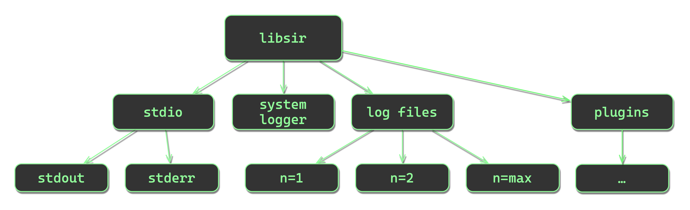

# libsir

libsir&mdash;a cross-platform, thread-safe logging library

<!-- SPDX-License-Identifier: MIT -->
<!-- Copyright (c) 2018-current Ryan M. Lederman <lederman@gmail.com> -->

&nbsp;&nbsp;&nbsp;&nbsp;

## <a id="overview" /> Overview

<!-- toc -->

- [Synopsis](#synopsis)
- [Notables](#notables)
- [Cross-platform compatibility](#cross-platform-compatibility)
- [An example](#an-example)
- [Building from source](#building-from-source)
  - [Visual Studio Code](#visual-studio-code)
  - [Visual Studio 2022](#visual-studio-2022)
  - [Unix Makefile](#unix-makefile)
- [Dig in](#dig-in)

<!-- tocstop -->

## <a id="synopsis" /> Synopsis

libsir is a cross-platform, thread-safe logging library written in C (*ISO/IEC 9899:2011 C11*) that is designed to simplify and streamline the generation and distribution of human-readable information in software.

Using libsir, you can make a single call that simultaneously sends information to multiple destinations, *each with their own individual preference for format and levels*.

Each 'level' or 'priority' of output can be visually styled however you wish for `stdio` destinations. This allows for immediate visual confirmation that a message appeared in the terminal that you should pay attention to, while less pressing information is more subtle in appearance.

## <a id="notables" /> Notables

- No dependencies (other than `libc` and `pthreads`). On Windows, libsir uses the native synchronization API.
- Accompanied by a robust test suite to ensure dependable behavior, even if you make modifications to the source.
- Won't fail silently&mdash;C library or platform level errors are captured and stored for posterity, on a per-thread basis. The *function, file, and line number from which it originated* are also captured. Additionally, libsir defines its own set of error messages to aid in troubleshooting.
- Hardened&mdash;every function contains sanity checks for internal state as well as arguments passed in through the external interfaces. libsir's make recipes use *‑Wall&nbsp;‑Wextra&nbsp;‑Wpedantic*, too.
- [Full documentation](https://libsir.rml.dev), thanks to Doxygen.
- Lightweight&mdash;the shared library comes in at around 64&nbsp;KiB, and the static library around 60&nbsp;KiB.

## <a id="cross-platform-compatibility" /> Cross-platform compatibility

At this time, libsir is supported (*that is, it compiles and passes the test suite*) on at least the following operating system and toolchain combinations:

| System | Toolchain |
| ------:|:--------- |
| **Linux**&nbsp;≳2.6.32 (glibc&nbsp;2.18, musl&nbsp;≳1.2.3, uClibc‑ng&nbsp;1.0.43, Bionic&nbsp;19) | **GCC**&nbsp;(4.8.4&nbsp;‑&nbsp;13.1.1),&nbsp; **Clang**&nbsp;(3.8&nbsp;‑&nbsp;16.0.6),&nbsp; **Oracle&nbsp;Studio&nbsp;C/C++**&nbsp;(≳12.6),&nbsp; **IBM&nbsp;Advance&nbsp;Toolchain**&nbsp;(14&nbsp;‑&nbsp;16),&nbsp; **IBM&nbsp;XL&nbsp;C/C++**&nbsp;(16.1),&nbsp; **IBM&nbsp;Open&nbsp;XL&nbsp;C/C++**&nbsp;(17.1.1),&nbsp; **NVIDIA&nbsp;HPC&nbsp;SDK&nbsp;C/C++**&nbsp;(23.5),&nbsp; **Arm&nbsp;HPC&nbsp;C/C++**&nbsp;(22.1),&nbsp; **AMD&nbsp;Optimizing&nbsp;C/C++**&nbsp;(4.0.0),&nbsp; **Intel&nbsp;oneAPI&nbsp;DPC++/C++**&nbsp;(2023.1),&nbsp; **Intel&nbsp;C++&nbsp;Compiler&nbsp;Classic**&nbsp;(2021.9),&nbsp; **Android&nbsp;NDK**&nbsp;(r25c),&nbsp; **Chibicc**&nbsp;(2020.12.6) |
| **AIX**&nbsp;7.2 | **GCC**&nbsp;(8.3&nbsp;‑&nbsp;11.3),&nbsp; **IBM&nbsp;XL&nbsp;C/C++**&nbsp;(16.1),&nbsp; **IBM&nbsp;Open&nbsp;XL&nbsp;C/C++**&nbsp;(17.1) |
| **macOS**&nbsp;≳10.15 | **Xcode**&nbsp;(12.4&nbsp;‑&nbsp;15),&nbsp; **GCC**&nbsp;(10.4&nbsp;‑&nbsp;13.1),&nbsp; **Clang**&nbsp;(12.0.1&nbsp;‑&nbsp;16.0.6),&nbsp; **Intel&nbsp;C++&nbsp;Compiler&nbsp;Classic**&nbsp;(2021.9) |
| **Windows**&nbsp;≳10, 11 | **Microsoft&nbsp;Visual&nbsp;C/C++**&nbsp;(17.6),&nbsp; **GCC‑MinGW**&nbsp;(12.2.1&nbsp;‑&nbsp;13.1.1),&nbsp; **LLVM‑MinGW**&nbsp;(15.0&nbsp;‑&nbsp;16.0.6) |
| **Cygwin**&nbsp;3.4 | **GCC**&nbsp;(11.2&nbsp;‑&nbsp;11.4) |
| **FreeBSD**&nbsp;≳11.3 | **GCC**&nbsp;(11.4&nbsp;‑&nbsp;12.2),&nbsp; **Clang**&nbsp;(10&nbsp;‑&nbsp;14.0.5) |
| **NetBSD**&nbsp;9.2 | **GCC**&nbsp;(7.5&nbsp;‑&nbsp;13.1),&nbsp; **Clang**&nbsp;(15.0.7) |
| **OpenBSD**&nbsp;7.3 | **GCC**&nbsp;(11.2),&nbsp; **Clang**&nbsp;(13) |
| **DragonFly**&nbsp;**BSD**&nbsp;6.4 | **GCC**&nbsp;(8.3&nbsp;‑&nbsp;13),&nbsp; **Clang**&nbsp;(10.0.1&nbsp;‑&nbsp;16.0.6) |
| **Haiku**&nbsp;R1b4 | **GCC**&nbsp;(11.2),&nbsp; **Clang**&nbsp;(12.0.1) |
| **Solaris**&nbsp;11.4 | **GCC**&nbsp;(10.3&nbsp;‑&nbsp;11.2),&nbsp; **Clang**&nbsp;(6&nbsp;‑&nbsp;11),&nbsp; **Oracle&nbsp;Studio&nbsp;C/C++**&nbsp;(≳12.6) |
| **illumos** | **GCC**&nbsp;(7.5&nbsp;‑&nbsp;11.3),&nbsp; **Clang**&nbsp;(15.0.7) |
| **SerenityOS** | **GCC**&nbsp;(13.1) |

libsir is known to work on most common (and many uncommon) architectures.
It has actually been built and tested on **Intel** (x86\_64, i686), **ARM** (ARMv6, ARMv7HF, ARMv8‑A), **POWER** (PowerPC, PPC64, PPC64le), **MIPS** (MIPS64, MIPS32, 74Kc), **z/Architecture** (S390X), **SuperH** (SH‑4A), **RISC‑V** (RV64), **OpenRISC** (OR1200), and **m68k** (68020+).
If it doesn't work on your machine, it's probably a bug.

## <a id="an-example" /> An example

Some sample terminal output from libsir demonstrating the default configuration:

This output is from the `example` application, whose source code can be located in the [example](https://github.com/aremmell/libsir/tree/master/example) directory. If you're curious about a basic implementation of libsir in a practical context, that's a good place to start.

## <a id="building-from-source" /> Building from source

There are several options if you would like to build libsir from source:

### <a id="visual-studio-code" /> Visual Studio Code

There is a `code‑workspace` in the repository. As of right now, the build and launch tasks are not fully functional for every platform, but everything else should be good to go.

### <a id="visual-studio-2022" /> Visual Studio 2022

A very recent addition is an `sln` and some `vcxproj` files in the [msvc](https://github.com/aremmell/libsir/tree/master/msvs) directory. They are confirmed to work correctly on Windows 11 (x64 &amp; Arm64) with Visual Studio 17.6.

### <a id="unix-makefile" /> Unix Makefile

| Recipe Type    |    Command          |       Output file(s)                                          |
| :------------: | :-----------------: | :-----------------------------------------------------------: |
| Test suite     |  `make tests`       |                  *build/bin/sirtests[.exe]*                   |
| Example app    | `make example`      |                  *build/bin/sirexample[.exe]*                 |
| Static library |    `make static`    |                   *build/lib/libsir_s.a*                      |
| Shared library |    `make shared`    |                    *build/lib/libsir.so*                      |
|    Install     | `make install` |    <ul><li>*$PREFIX/lib/libsir_s.a*</li><li>*$PREFIX/lib/libsir.so*</li><li>*$PREFIX/include/sir.h*</li><li>*$PREFIX/include/sir/\*.h*</li></ul>  |

## <a id="dig-in" /> Dig in

If you are genuinely interested in utilizing libsir, you are encouraged to read the [full online documentation](https://libsir.rml.dev) to get a better understanding of the library's capabilities and interfaces.

Suggested initial sections:

- [Public Functions](https://libsir.rml.dev/group__publicfuncs.html)
- [Public Types](https://libsir.rml.dev/group__publictypes.html)
- [Configuration](https://libsir.rml.dev/config.html)
- [Test suite](https://libsir.rml.dev/testsuite.html)
